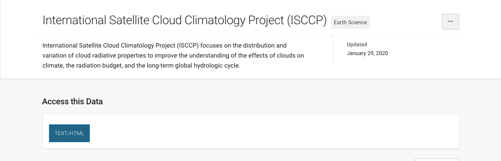
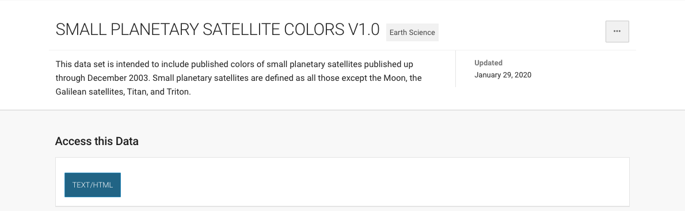
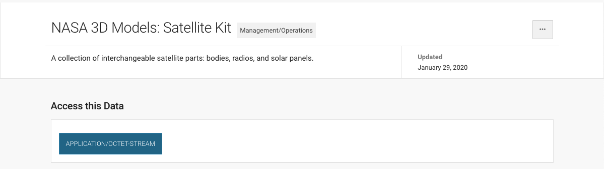
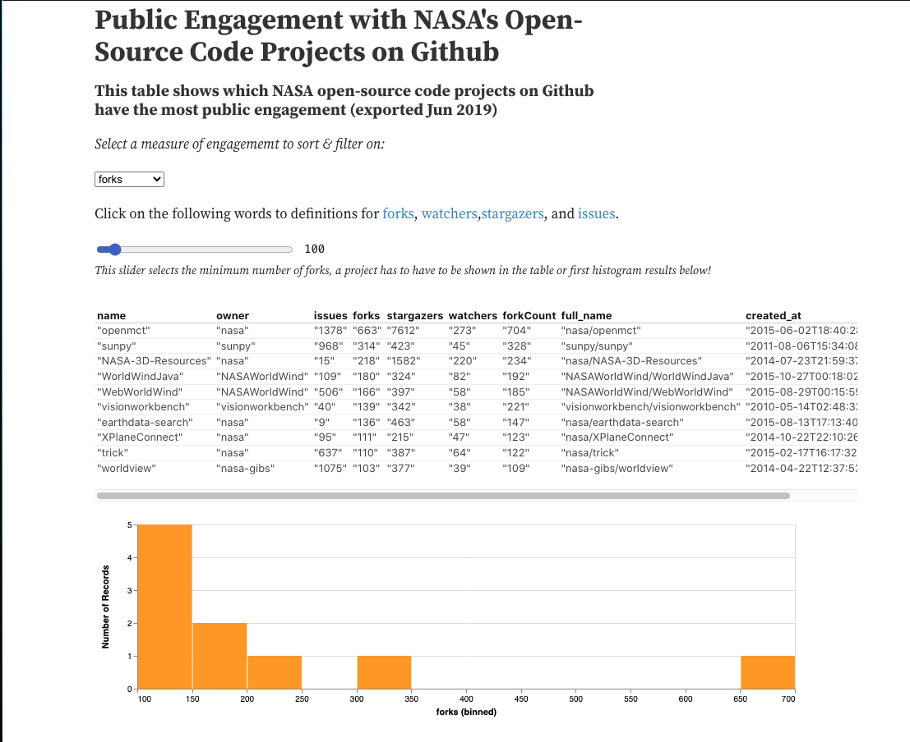

# Space Tracker

## High-Level Project Summary

‘Space Tracker’ is an open-source, web browser application that tracks the International Space Station and satellites location in 3 dimension depictions, as well as providing other extra information, their orbital path for example. All the while being an open-source code application, meaning that our ever innovating communities of space exploration enthusiasts can always help improve and further refine our application to be more user-friendly, informative, and versatile for everyone. To illustrate the importance of the development of this app, we could easily compare it to globalization, when more information could get to more people, it means more unique minds to drive humanity even closer to our cause.

# Link to Final Project ans Demo

* [Website](https://space-tracker-7fcb2.web.app/index.html)
* [YouTube](https://youtu.be/aLIQ4BraTaI)

## Detailed Project Description

### What is ‘Space Tracker’? 

Space Track is a web application that show satellites orbiting the earth by a two-line element set (TLE) data

### How it work?

* We use html css and Javascript to make it.
* It takes TLE data from the web and converts it to geolocation using a javascript library (satellite.js).The satellite icon that we will be observing will follow its own orbit where we can press the orbital path.

### What we hope to achieve:

We want to make people that don’t have much money can access to view data of satellite orbiting the earth and we want to make it as an open source code soother people can fix or innovate ideas in to it

## Space Agency Data

There is a lot of NASA space agency data available to support us. E.B. Space did some research on these data and highlight the parts that maybe useful for our project: 

## Hackathon Journey

### What inspired us to choose this challenge?:

'A journey of a million light years begin with a single step'. As we take our first step, we would like to lend a hand to others for their first step too.
						
E.B. Space wanted to be a part of creating a platform of opportunities. Opportunities for everyone to learn about what they are interested in, opportunities for them to enjoy themselves, and opportunities for them to follow their dreams.

### Our approach to developing ‘Space Tracker’:

After creating the team and gathering members, we started off by choosing the challenge based on our interests and strengths. We then started brainstorming and creating plans and pictures of the completed product. Next, we delegated tasks, having set deadlines for each one.On the day of the hackathon, after each task was finished, we took turns in checking and editing each other’s work. After making sure each section is completed to the satisfaction of the team, we combined them together, creating one big project. Then we tested the product and each gave feedback on how to improve it.And from all those work and effort, we are able to innovate an app that can detect or track Earth's satellites, as we take our first step on our journey to the moon.

### Problems we encountered and how we resolved them:

During the preparation and especially during the hackathon, we encountered many problems. The first, and most annoying problem we faced was technical difficulties. One of our member’s computers decides to randomly update itself, causing it to shut down during our introduction video editing. We tried to get our video file back but we couldn’t, so we had to re-edit the whole video again. The other problem we ran into was time-synchronization between team members. Having such limited time was so pressuring as well. We found out about this hackathon quite late so we had to work more efficiently to outweigh the time we lost. Additionally, we are all Thai first language speakers, working with English is, undeniably, one of our biggest challenges. We, therefore, have to check and edit each other’s work as we go along to make sure that the language used is suitable for the topic and look out for grammatical errors.

### Overall experience:

In the NASA Space Apps Challenge, our experience can be described as one word: CHAOTIC! It was very chaotic having to work everything out by ourselves, delegating jobs, completing tasks, making sure everyone is on the same page, keeping track of the timeline, etc. However, it, surprisingly, was such a wonderful experience. There was a lot of arguing, agreeing, and adjusting going on. We each developed so many skills from this hackathon, such as teamwork, communication, leadership, organization, problem-solving, and so many more. After all, we would like to say a very big thank you to everyone involved in making this great event happen and our parents for the support.

### 3 Words for the Space Apps experience from each of our team members:

* Chitipat: Endurance, Suffer, Sleepy
* Daranpop: Confusing, Challenging, fulfilling
* Krit: u,w,u
* Sethapong: Headache, Enjoy, Chaotic
* Tapanut: Go, Went, Gone
* Vivid: Suffering, Enjoyable, Chaotic

## References
Data from NASA Links: 
* https://data.nasa.gov/Earth-Science/SMALL-PLANETARY-SATELLITE-COLORS-V1-0/utgv-sc83
* https://data.nasa.gov/Earth-Science/International-Satellite-Cloud-Climatology-Project-/fxce-k96d
* https://worldwind.arc.nasa.gov/web/examples/

Other:
* http://celestrak.org/NORAD/elements/gp.php?GROUP=active&FORMAT=tle
* http://celestrak.org/NORAD/elements/gp.php?GROUP=stations&FORMAT=tle
* https://observablehq.com/@justingosses/public-engagement-with-nasas-open-source-code-projects-on-g
